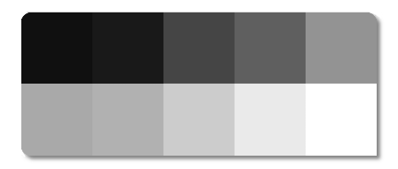
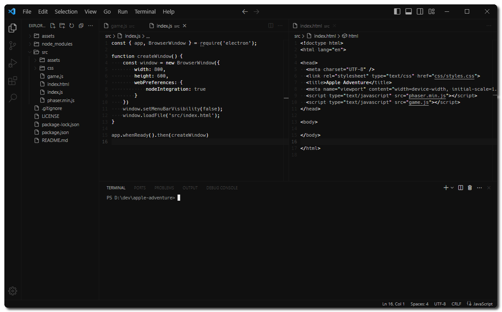

<div align='center'>
    <p style="font-family: monospace, monospace; font-size: 20px;">monochrome.</p>
</div>

<div align='center'>
    
    <div>
    <i>A monochromatic color theme without additional nonsense.</i>
    </div>
    <br>
    <div>
    <a></a>
    <a></a>
    <a></a>
    </div>
</div>

<br>

# 📷 Gallery

<br>

# 🔌 Installation

- Launch Quick Open with `Cmd+P` or `Ctrl+P`
- Paste the command `ext install nord-dark-contrast`
- Click __Install__ to install it
- Click __Reload__ to reload your editor
- Code/File ＞ Preferences ＞ Color Theme ＞ `Monochrome`<br><br>

# ✨ Suggestions

### Font

- [Hack](https://sourcefoundry.org/hack/)

### Settings

```json
{
    "workbench.activityBar.visible": false,
    "window.menuBarVisibility": "toggle",
    "editor.minimap.enabled": false,
    "explorer.openEditors.visible": 0,
    "editor.glyphMargin": false,
    "breadcrumbs.enabled": false,
    "editor.renderWhitespace": "boundary",
    "editor.guides.indentation": false,
    "editor.folding": false,
    "editor.bracketPairColorization.enabled": false,
}
```

### Other works

- *[Nord Dark Contrast](https://marketplace.visualstudio.com/items?itemName=simojanhunen.nord-dark-contrast)*

<br>

# 🐛 Issues, improvements, and utilization

- Please use [Issues](https://github.com/simojanhunen/nord-dark-contrast/issues) tab to communicate any troubling issues or possible improvements.
- Feel free to fork the repository and use this theme as a base for [creating](https://code.visualstudio.com/docs/getstarted/themes#_creating-your-own-color-theme) your very own theme, you may provide credits but it's not by any means mandatory to do so.
